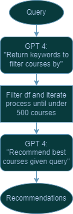
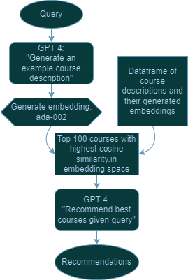

# UMGPT Recommender

## Overview
The UMGPT Recommender is a Python-based course recommendation system housed in the `umgpt_recommender` folder. This system leverages the power of GPT-4 to recommend educational courses tailored to students' queries. The main script is: `umgpt_recommender.py` - A course recommender system that filters and recommends courses based on student requests.
The script contains two classes, a Recommender and EmbeddingRecommender class.


## Contents
- `Recommender`: Initializes with a DataFrame containing course names and descriptions, uses GPT-4 to iteratively filter and recommend courses.
  -  It does this  by iteratively filtering the data frame by querying the gpt4 API to return relevant keywords and does this iteratively until there are less than 150 courses in the filtered_df. Then, it queries gpt4 with the student's query and the list of filtered courses and asks it to recommend the best courses in list format. 

  
- `EmbeddingRecommender`: Initializes with a DataFrame containing course names, descriptions, and embeddings of descriptions. Uses similarity in the embedding space to find courses to recommend from.
  -  It does this by using gpt4 to return as example course description for a course related to the student's query. It then produces an embedding of this descrption and finds the top 100 courses in terms of cosine similarity. Then, it queries gpt4 with the student's query and the list of courses and asks it to recommend the best courses in list format. 

  

## Usage
### Prerequisites
The UMGPT Recommender assumes access to the UM GPT API hosted on Microsoft AZURE. A .env file is assumed to be correctly formatted like below:
```
OPENAI_API_KEY=key
OPENAI_API_VERSION=2023-05-15
OPENAI_API_BASE=https://api.umgpt.umich.edu/azure-openai-api
OPENAI_ORGANIZATION_ID=id
OPENAI_MODEL=gpt-4-32k
OPENAI_EMBEDDING_MODEL=text-embedding-ada-002
```

### Initializing the Recommender

Before using the `recommend()` function, initialize the recommender by loading your course DataFrame with columns "course" and "description":

```python
import umgpt_recommender

# Load your DataFrame here
courses_df = pd.read_csv('path_to_your_courses.csv')
recommender = umgpt_recommender.Recommender(courses_df)
```

### Getting Recommendations
To get course recommendations based on a student's query:
```python
query = "I want to learn about artificial intelligence, what are some courses that I could take?"
# Without filtering reccommendations by course level
recommended_courses = recommender.recommend(query=query)
# With filtering by course level
recommended_courses = recommender.recommend(level=[100, 200], query=query)
print(recommended_courses)
```
