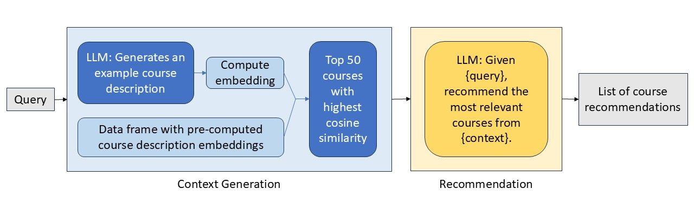

# UMGPT Recommender

## Overview
The UMGPT Recommender is a Python-based course recommendation system designed to help students discover relevant courses based on their interests and academic goals. The main system is housed in the `recommender` folder and leverages GPT-4 and embedding-based similarity to provide high-quality, personalized recommendations.

## Embedding Recommender
The core of the system is the `EmbeddingRecommender`, which uses course description embeddings to find and recommend courses most relevant to a student's query. The process involves:
- Generating an example course description for the student's query using GPT-4.
- Creating an embedding for this description.
- Finding the most similar courses in the embedding space.
- Asking GPT-4 to select and explain the best matches from the filtered list.

<p align="center">
  
</p>

## Demo


## Usage
### Prerequisites
The UMGPT Recommender assumes access to the UM GPT API hosted on Microsoft AZURE. A `.env` file is required and should be formatted as follows:
```
OPENAI_API_KEY=key
OPENAI_API_VERSION=2023-05-15
OPENAI_API_BASE=https://api.umgpt.umich.edu/azure-openai-api
OPENAI_ORGANIZATION_ID=id
GENERATOR_MODEL=gpt-4
RECOMMENDER_MODEL=gpt-4
OPENAI_EMBEDDING_MODEL=text-embedding-ada-002
```

### Initializing the Recommender (Async Version)
Before using the `recommend()` function, set up the recommender as follows:

```python
import os
from dotenv import load_dotenv
import pandas as pd
from recommender.recommender import AsyncOpenAIClient, CosineSimilarityCalculator, EmbeddingRecommender

# Load environment variables
load_dotenv()

# Set up config dictionary
config = {
    "OPENAI_API_KEY": os.getenv("OPENAI_API_KEY"),
    "OPENAI_API_VERSION": os.getenv("OPENAI_API_VERSION"),
    "OPENAI_API_BASE": os.getenv("OPENAI_API_BASE"),
    "OPENAI_ORGANIZATION_ID": os.getenv("OPENAI_ORGANIZATION_ID"),
    "GENERATOR_MODEL": os.getenv("GENERATOR_MODEL", "gpt-4"),
    "RECOMMENDER_MODEL": os.getenv("RECOMMENDER_MODEL", "gpt-4"),
    "OPENAI_EMBEDDING_MODEL": os.getenv("OPENAI_EMBEDDING_MODEL", "text-embedding-ada-002")
}

# Initialize components
openai_client = AsyncOpenAIClient(config)
similarity_calculator = CosineSimilarityCalculator()
recommender = EmbeddingRecommender(openai_client, similarity_calculator)

# Load your DataFrame (must include 'course', 'description', 'embedding', and optionally 'level')
courses_df = pd.read_pickle('path_to_your_courses.pkl')
recommender.load_courses(courses_df)
```

### Getting Recommendations
To get course recommendations based on a student's query:
```python
import asyncio

query = "I want to learn about artificial intelligence, what are some courses that I could take?"

# For a single recommendation (not streaming)
recommendation = asyncio.run(recommender.recommend(query=query, levels=[100, 200]))
print(recommendation)
```

## About `/course_similarity/`
The `/course_similarity/` directory contains some old, early analysis and is not part of the main recommender system.

## Analysis Summary
- Explored various approaches for course recommendation, including keyword-based and embedding-based methods.
- Performed early data cleaning, visualization, and similarity analysis (see `/course_similarity/`).
- Evaluated recommender performance, bias, and confidence through multiple experiments and notebooks in the `recommender` folder.
- Developed and refined the embedding-based recommender as the primary system for robust, personalized course recommendations.
